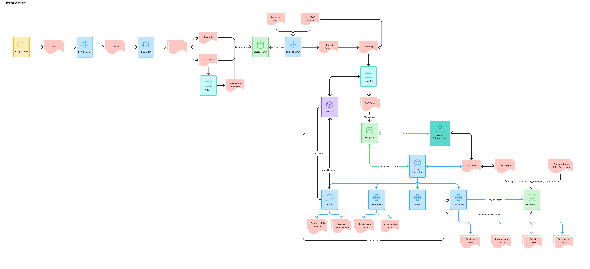

# 🤖 Automating ESG Data Extraction and Performance Analysis

## Repository Description

This repository contains the code, documentation, and resources for Group 6 of the NUS course DSA3101: Data Science in Practice for the AY24/25 Semester 2.

## Project Description

This project aims to design an automated ESG data extraction and performance evaluation system through the use of Natural Language Processing techniques.

## 🔍 Project Overview

The flow diagram below shows the flow of some of the main features but not all since there is not enough space to fit all. Missing components include scraping of external data from NewsAPI and evaluation of ESG extraction model.



## 🌟 Key Features

1) Web app to display ESG data (located in `frontend/`, `backend/`)
    - Dashboard to show ESG data by company
    - Leaderboard to compare companies
    - Built in recommendation to tailor views to users
    - Chatbot for users to ask questions about ESG data
2) ESG data extraction model (located in `models/`, `data-pipelines/`)
    - Extracts ESG data from PDF reports (`data-pipelines/`)
    - Web scrape external ESG data (`data-pipelines/`)
    - Fact check extracted ESG data with external scraped data (`data-pipelines/`)
    - Model serves as endpoint for chatbot (`models/`)
    - Model Evaluation (for ESG data extraction model) (`models/`)
3) LSTM stocks price forecasting model (located in `models/`)

## ✈️ Web App Quick Start

### Pre-requisites

- **Programming Languages**
    - [**Python 3.10**](https://www.python.org/downloads/)
    - [**Java 11**](https://www.oracle.com/sg/java/technologies/downloads/#java11)
- **Softwares**
    - [**Apache Spark**](https://spark.apache.org/downloads.html)
    - [**Docker Desktop**](https://www.docker.com/products/docker-desktop/)
    - [**Ollama**](https://ollama.com/download)
    - [**Node.js**](https://nodejs.org/en/download)
    
> [!NOTE]
> All the above softwares can be easily installed from the official website. For Apache Spark, it requires a few additional steps to setup correctly. Please refer to the `README.md` documentation at [`data-pipelines/`](data-pipelines/README.md) for more details.

### 1. Cloning Repo

Open Git Bash and run the following commands to clone the repository.

```bash
cd <desired-local-directory>
```

```bash
git clone https://github.com/zzhenjie01/dsa3101-ay2425s2-team6.git
```

### 2. Creation of `.env` files

Create `.env` files created in the necessary locations: `data-pipelines/`, `docker/`, `backend/`, `models/esg-data-extraction-model/model-code/`, `models/esg-data-extraction-model/model-test/`, `models/stock-price-forecast-model/`

- Create `.env` at `data-pipelines/` with the following

    ```text
    ESG_REPORTS_PDF_FOLDER=data/esg-pdf/
    ESG_REPORTS_JSON_FOLDER=data/esg-json/
    ESG_REPORTS_CSV_FOLDER=data/esg-spark-processed-csv/
    REPORT_ES_INDEX_NAME='esg_reports'
    ES_HOST='http://localhost:9200/'
    RAG_OUTPUT_DIR=data/esg-metric/
    ESG_MODEL_METRIC_EXTRACTION_URL='http://localhost:8000/esg-data-extraction-model/extract-esg-metrics'

    NEWSAPI_API_KEY=<api_key>
    EXTERNAL_SCRAPE_INDEX_NAME='external_esg_data'
    EXTERNAL_ESG_DATA_CSV_FOLDER=data/external-esg-data-csv/
    RAG_OUTPUT_FILENAME=rag_output.json
    ESG_REPORT_VAL_AGAINST_EXT_DATA_FOLDER=data/esg-data-against-external-eval/
    ESG_REPORT_VAL_AGAINST_EXT_DATA_FILENAME=esg-data-against-external-eval.csv
    ```

- Create `.env` at `docker/` with the following.

    ```text
    MONGODB_USERNAME=root
    MONGODB_PASSWORD=root
    POSTGRES_USER=postgres
    POSTGRES_PASSWORD=root
    ```

- Create `.env` at `backend/` with the following.

    ```text
    MONGODB_USERNAME=root
    MONGODB_PASSWORD=root
    POSTGRES_USER=postgres
    POSTGRES_PASSWORD=root
    EXPRESS_PORT=5000
    JWT_KEY="testing"
    ```

- Create `.env` file at `models/esg-data-extraction-model/model-code` with the following.

    ```text
    ES_HOST='http://localhost:9200/'
    ES_INDEX_NAME='esg_reports'
    ```

- Create `.env` file at `models/esg-data-extraction-model/model-tests` with the following.

    ```text
    ESG_MODEL_METRIC_EXTRACTION_URL='http://localhost:8000/esg-data-extraction-model/question-and-answer'
    TC_FOLDER_DIR=evaluation_data/
    TC_EVAL_RESULT_DIR=evaluation_results/
    ```

- Create `.env` file at `models/stock-price-forecast-model/`

    ```text
    BANK_STOCKS_DATA_FOLDER_DIR='bank_stocks_data/'
    ```

### 3. Install Python Libraries

Head over to `data-pipelines/` and run the following command to install the python libraries.

```shell
pip install -r requirements.txt
```

### 4. Pulling LLM

Make sure Ollama is installed and running in the background. Open a terminal and run the following command to pull Llama 3.2 model.

```shell
ollama pull llama3.2
```

### 5. Initializing Containers

Make sure Docker Desktop is running in the background. Run the following command in terminal to pull and start all the necessary containers (MongoDB, PostgreSQL, Elasticsearch)

```shell
docker compose up -d
```

### 6. Copy Stocks Data into PSQL

Make sure you are in `docker/` folder. Run the following command in terminal to copy bank stocks data into PostgreSQL container.

```shell
docker cp ./companies_stock_price_data.csv postgres:/var/lib/postgresql/data
```

### 7. Setting Up Backend

Head over to `backend/` and run the following commands in terminal sequentially.

> [!WARNING]
> If it is your first time running, you need to create root user for MongoDB or the commands won't run. Refer to `README.md` in [`backend/`](backend/README.md) for more information.

```shell
npm install
```

```shell
node src/server.js
```

> [!NOTE]
> Once the backend server starts running, do not touch the terminal. Open a new terminal for subsequent tasks.

### 8. Indexing PDF Reports into Elasticsearch

First download the ESG PDF reports from [Google Drive](https://drive.google.com/drive/folders/1NXaHl4MyrZNW14tCktLxSYUmrs52NATD?usp=sharing) and place them at `data-pipelines/data/esg-pdf`.

Open a new terminal and go to `data-pipelines/`. Run the following command to index the ESG PDFs into Elasticsearch so that the Chatbot has ESG data to retrieve.

```shell
python pdf_to_elasticsearch.py
```

> [!CAUTION]
> Depending on hardware, it may take a while (a few minutes) to finish running. Please wait patiently and do not exit.

### 9. Starting Model Endpoint

Go to `models/esg-data-extraction-model/model-code/` and run the following in terminal. This allows the chatbot to have an endpoint to call to.

```shell
uvicorn esg_extraction_model_endpoint:app
```

> [!NOTE]
> Once the endpoint server starts running, do not touch the terminal. Open a new terminal for subsequent tasks.

### 10. Starting the Frontend

Open a new terminal and go to `frontend/`. Then run the following commands sequentially to install packages and run in development mode.
6) start the frontend using the follow commands in `frontend/`:

```shell
npm install
```

```shell
npm run dev
```

Once the frontend is up, you you can go open a browser and paste the following to access the webapp.

```shell
http://localhost:5173/
```

### 11. Closing Web App

Once done you are done exploring the web app, press `Ctrl + C` in all the terminals to exit. And you can go to Docker Desktop to stop all the containers.

> [!IMPORTANT]
> Shutting down your servers after you are done with the application is important.
> Failure to do so can cause issues later down the road, such as errors during the set-up of the backend server.
> An example: https://stackoverflow.com/questions/54922433postgresql-fatal-the-database-system-is-starting-up-windows-10

>[!Note]
> The following features are not covered in the above guide. Please refer to the individual documentations for more details.
>
> - Generating ESG metrics using ESG extraction model (under ['data-pipelines/`](data-pipelines/README.md))
> - Scraping external data from NewsAPI (under ['data-pipelines/`](data-pipelines/README.md))
> - Fact checking of ESG report data against external data (under ['data-pipelines/`](data-pipelines/README.md))
> - Evaluating ESG extraction model (under [`models/](models/README.md))
> - Using LSTM forecasting model (under [`models/`](models/README.md))

## 📋 Documentations

- [Docker](docker/README.md)
- [Data Pipelines](data-pipelines/README.md)
- [Backend](backend/README.md)
- [Frontend](frontend/README.md)
- [Models](models/README.md)

## Ports Used

Do not clash these ports as they are mainly TCP in nature

- **5678:** PostgreSQL
- **9200:** Elasticsearch
- **27017:** MongoDB
- **9090:** Spark Image UI
- **7077**: Spark master in spark iamge
- **5173:** Web app (client side)
- **5000:** Web app (server side)
- **8000:** ESG extraction model
- **11434:** Ollama

## 🌐 Repository Structure

```text
.
├── attachments
├── backend
│   ├── attachments
│   ├── node_modules
│   ├── src
│   │   ├── api
│   │   │   ├── controllers
│   │   │   │   ├── authController.js
│   │   │   │   ├── authHelper.js
│   │   │   │   ├── clickController.js
│   │   │   │   ├── clickHelper.js
│   │   │   │   ├── companyController.js
│   │   │   │   └── weightsController.js
│   │   │   ├── misc
│   │   │   │   └── guestProfile.js
│   │   │   ├── models
│   │   │   │   ├── companyModel.js
│   │   │   │   ├── postgresDB.js
│   │   │   │   └── userModel.js
│   │   │   └── routes
│   │   │       ├── authRoutes.js
│   │   │       ├── baseRouter.js
│   │   │       ├── clickRoutes.js
│   │   │       ├── companyRoutes.js
│   │   │       └── weightsRoutes.js
│   │   ├── createUsers.js
│   │   ├── esgScoresHelper.js
│   │   ├── mongoDB.js
│   │   ├── pgDB.js
│   │   └── server.js
│   ├── .env
│   ├── .gitignore
│   ├── README.md
│   ├── esg_data.json
│   ├── package-lock.json
│   └── package.json
├── data-pipelines
│   ├── attachments
│   ├── data
│   │   ├── esg-json
│   │   │   ├── 2022_Citigroup_ESG_Report.json
│   │   │   ├── 2023_BOQ_ESG_Report.json
│   │   │   ├── 2023_Banco-Santander_ESG_Report.json
│   │   │   ├── 2023_DBS_ESG_Report.json
│   │   │   ├── 2023_HSBC_ESG_Report.json
│   │   │   ├── 2023_JPMorgan_ESG_Report.json
│   │   │   ├── 2023_Krungthai-Bank_ESG_Report.json
│   │   │   ├── 2023_Nubank_ESG_Report.json
│   │   │   ├── 2023_OCBC_ESG_Report.json
│   │   │   ├── 2023_Woori-Financial-Group_ESG_Report.json
│   │   │   ├── 2024_ANZ_ESG_Report.json
│   │   │   ├── 2024_Bank-of-China_ESG_Report.json
│   │   │   └── 2024_Commonwealth-Bank-of-Australia_ESG_Report.json
│   │   ├── esg-pdf
│   │   │   ├── 2022_Citigroup_ESG_Report.pdf
│   │   │   ├── 2023_BOQ_ESG_Report.pdf
│   │   │   ├── 2023_Banco-Santander_ESG_Report.pdf
│   │   │   ├── 2023_DBS_ESG_Report.pdf
│   │   │   ├── 2023_HSBC_ESG_Report.pdf
│   │   │   ├── 2023_JPMorgan_ESG_Report.pdf
│   │   │   ├── 2023_Krungthai-Bank_ESG_Report.pdf
│   │   │   ├── 2023_Nubank_ESG_Report.pdf
│   │   │   ├── 2023_OCBC_ESG_Report.pdf
│   │   │   ├── 2023_Woori-Financial-Group_ESG_Report.pdf
│   │   │   ├── 2024_ANZ_ESG_Report.pdf
│   │   │   ├── 2024_Bank-of-China_ESG_Report.pdf
│   │   │   └── 2024_Commonwealth-Bank-of-Australia_ESG_Report.pdf
│   │   └── esg-spark-processed-csv
│   │       ├── 2022_Citigroup_ESG_Report.csv
│   │       ├── 2023_BOQ_ESG_Report.csv
│   │       ├── 2023_Banco-Santander_ESG_Report.csv
│   │       ├── 2023_DBS_ESG_Report.csv
│   │       ├── 2023_HSBC_ESG_Report.csv
│   │       ├── 2023_JPMorgan_ESG_Report.csv
│   │       ├── 2023_Krungthai-Bank_ESG_Report.csv
│   │       ├── 2023_Nubank_ESG_Report.csv
│   │       ├── 2023_OCBC_ESG_Report.csv
│   │       ├── 2023_Woori-Financial-Group_ESG_Report.csv
│   │       ├── 2024_ANZ_ESG_Report.csv
│   │       ├── 2024_Bank-of-China_ESG_Report.csv
│   │       └── 2024_Commonwealth-Bank-of-Australia_ESG_Report.csv
│   ├── esg_csv_to_elasticsearch
│   │   └── elasticsearch_indexing.py
│   ├── esg_gdrive_to_local
│   │   ├── esg_gdrive_to_local.py
│   │   └── esg_gdrive_to_local_func.py
│   ├── esg_json_to_csv
│   │   ├── esg_json_to_csv.py
│   │   └── esg_json_to_csv_func.py
│   ├── esg_pdf_to_json
│   │   ├── esg_pdf_to_json.py
│   │   └── esg_pdf_to_json_func.py
│   ├── fact_check_esg_report_against_ext
│   │   └── fact_check_esg_report_against_ext_func.py
│   ├── newsapi_csv_to_elasticsearch
│   │   └── newsapi_csv_to_elasticsearch_func.py
│   ├── newsapi_web_to_csv
│   │   └── newsapi_web_to_csv_func.py
│   ├── .env
│   ├── .gitignore
│   ├── README.md
│   ├── fact_check_esg_report_json_against_ext.py
│   ├── generate_esg_metrics_json.py
│   ├── newsapi_to_elasticsearch.py
│   ├── pdf_to_elasticsearch.py
│   └── requirements.txt
├── docker
│   ├── mongodb_data
│   ├── pgdata
│   ├── spark-docker
│   │   ├── conf
│   │   │   └── spark-defaults.conf
│   │   ├── .env.spark
│   │   ├── Dockerfile
│   │   ├── entrypoint.sh
│   │   └── requirements.txt
│   ├── .env
│   ├── .gitignore
│   ├── README.md
│   ├── companies_stock_price_data.csv
│   └── docker-compose.yaml
├── frontend
│   ├── node_modules
│   ├── src
│   │   ├── assets
│   │   │   ├── BankLogo
│   │   │   │   ├── ANZBAU3MXXX_FULL.svg
│   │   │   │   ├── ANZBAU3MXXX_RECT.svg
│   │   │   │   ├── BKCHSGSGXXX_FULL.svg
│   │   │   │   ├── BKCHSGSGXXX_RECT.svg
│   │   │   │   ├── BSCHESMMXXX_FULL.svg
│   │   │   │   ├── BSCHESMMXXX_RECT.png
│   │   │   │   ├── CTBAAU2SXXX_FULL.svg
│   │   │   │   ├── CTBAAU2SXXX_RECT.png
│   │   │   │   ├── DBSSSGSGXXX_FULL.svg
│   │   │   │   ├── DBSSSGSGXXX_RECT.svg
│   │   │   │   ├── HSBCSGS2XXX_FULL.svg
│   │   │   │   ├── HSBCSGS2XXX_RECT.svg
│   │   │   │   ├── HVBKKRSEXXX_FULL.png
│   │   │   │   ├── HVBKKRSEXXX_RECT.svg
│   │   │   │   ├── KRTHTHBKXXX_FULL.png
│   │   │   │   ├── KRTHTHBKXXX_RECT.png
│   │   │   │   ├── NUBANK_FULL.svg
│   │   │   │   ├── NUBANK_RECT.svg
│   │   │   │   ├── OCBCSGSGXXX_FULL.svg
│   │   │   │   ├── OCBCSGSGXXX_RECT.svg
│   │   │   │   ├── QBANAU4BXXX_FULL.svg
│   │   │   │   ├── QBANAU4BXXX_RECT.png
│   │   │   │   ├── SBSPSGS1XXX_FULL.svg
│   │   │   │   ├── SBSPSGS1XXX_RECT.png
│   │   │   │   ├── getLogoFull.js
│   │   │   │   └── getLogoPart.js
│   │   │   └── loginbackground.jpg
│   │   ├── components
│   │   │   ├── chatbot
│   │   │   │   ├── chatbotBtn.jsx
│   │   │   │   ├── chatbotInput.jsx
│   │   │   │   ├── chatbotMessages.jsx
│   │   │   │   ├── chatbotState.jsx
│   │   │   │   └── chatbotToggle.jsx
│   │   │   ├── dashboard
│   │   │   │   ├── Chart.jsx
│   │   │   │   ├── boardGender.jsx
│   │   │   │   ├── corruption.jsx
│   │   │   │   ├── energy.jsx
│   │   │   │   ├── environmentalCard.jsx
│   │   │   │   ├── forecast.jsx
│   │   │   │   ├── genderRatio.jsx
│   │   │   │   ├── governanceCard.jsx
│   │   │   │   ├── overallGhg.jsx
│   │   │   │   ├── scopeGhg.jsx
│   │   │   │   ├── socialCard.jsx
│   │   │   │   ├── turnover.jsx
│   │   │   │   └── water.jsx
│   │   │   ├── helpers
│   │   │   │   ├── getLastYear.jsx
│   │   │   │   └── parseJson.jsx
│   │   │   ├── icons
│   │   │   │   ├── lightning.jsx
│   │   │   │   └── waterDroplet.jsx
│   │   │   ├── leaderboard
│   │   │   │   ├── UserRecommendations.jsx
│   │   │   │   ├── leaderboardRow.css
│   │   │   │   └── leaderboardRow.jsx
│   │   │   ├── misc
│   │   │   │   ├── Footer.jsx
│   │   │   │   ├── Header.jsx
│   │   │   │   ├── LinkButton.jsx
│   │   │   │   ├── LoginBtn.jsx
│   │   │   │   ├── LogoutBtn.jsx
│   │   │   │   ├── NavBtn.jsx
│   │   │   │   ├── WeightsButton.jsx
│   │   │   │   ├── sidePanel.jsx
│   │   │   │   └── welcomeMsg.jsx
│   │   │   └── ui
│   │   │       ├── button.jsx
│   │   │       ├── card.jsx
│   │   │       ├── chart.jsx
│   │   │       ├── dialog.jsx
│   │   │       ├── input.jsx
│   │   │       ├── label.jsx
│   │   │       ├── loading-spinner.jsx
│   │   │       ├── select.jsx
│   │   │       └── slider.jsx
│   │   ├── context
│   │   │   ├── context.js
│   │   │   ├── contextFunction.jsx
│   │   │   └── guestProfile.js
│   │   ├── lib
│   │   │   └── utils.js
│   │   ├── pages
│   │   │   ├── dashboardPage.jsx
│   │   │   ├── homePage.jsx
│   │   │   ├── leaderboardPage.jsx
│   │   │   ├── loginPage.jsx
│   │   │   └── registerPage.jsx
│   │   ├── services
│   │   │   └── chatbotStorage.jsx
│   │   ├── App.jsx
│   │   ├── Routes.jsx
│   │   ├── index.css
│   │   └── main.jsx
│   ├── .gitignore
│   ├── README.md
│   ├── components.json
│   ├── eslint.config.js
│   ├── index.html
│   ├── jsconfig.json
│   ├── package-lock.json
│   ├── package.json
│   ├── tailwind.config.js
│   └── vite.config.js
├── models
│   ├── esg-data-extraction-model
│   │   ├── model-code
│   │   │   ├── .env
│   │   │   ├── chatbot_functions.py
│   │   │   ├── esg_extraction_model_endpoint.py
│   │   │   ├── metric_extraction_functions.py
│   │   │   ├── model_elasticsearch_functions.py
│   │   │   └── qna_functions.py
│   │   └── model-tests
│   │       ├── evaluation_data
│   │       │   ├── qualitative_nonmachinereadable.json
│   │       │   ├── qualitative_text_multichunk.json
│   │       │   ├── qualitative_text_singlechunk.json
│   │       │   ├── quantitative_nonmachinereadable.json
│   │       │   ├── quantitative_text_multichunk.json
│   │       │   └── quantitative_text_singlechunk.json
│   │       ├── .deepeval
│   │       ├── .deepeval_telemetry.txt
│   │       ├── .env
│   │       ├── evaluate_testcases.py
│   │       └── evaluate_testcases_func.py
│   ├── stock-price-forecast-model
│   │   ├── stocks_prediction_lstm.py
│   │   └── stocks_prediction_lstm_func.py
│   ├── .gitignore
│   ├── README.md
│   └── requirements.txt
├── .gitignore
└── README.md
```

## 🧊 Contributing

All contributions are to be merged to main via pull request.

### Branches

- branches recommended to follow the following format: `<username>-<feature>-<subfeature>`
- `<name>`: GitHub username or any name that is easy to identify the owner of the branch. Strictly no spaces and all letters in lowercase.
- `<feature>`: The name of the feature that the code is meant for.
- `<subfeature>`: Optional input. Depends on whether the main feature is being broken down into subfeatures due to its complexity.
- For example: `nghockleong-loginpage-userauthentication`

### Commit Messages

Be clear and concise with the intent of the commit.

### Coding guidelines

Follows general software engineering practices. Some examples of good practices are as follows:

- Clear documentation for code written
- Meaningful function and variable names
- Refactor overly complex code into smaller chunks of code
- Code should avoid being interdependent (Changing 1 code chunk does not require huge changes across other code chunks and modules)
- Adhere to official style guides for all languages to the best of your ability.
- Python style guide: [PEP 8 - Python Style Guide](http://www.python.org/dev/peps/pep-0008)
- Do not push your secrets such as API keys to GitHub; store them in a `.env` file instead.
- Do not push model checkpoint or weights files (`.pth` or `.pt`) to GitHub as you most likely won't succeed due to the large file size.
- Do not push datasets to GitHub as it may cuz the changes count to explode on GitHub.
