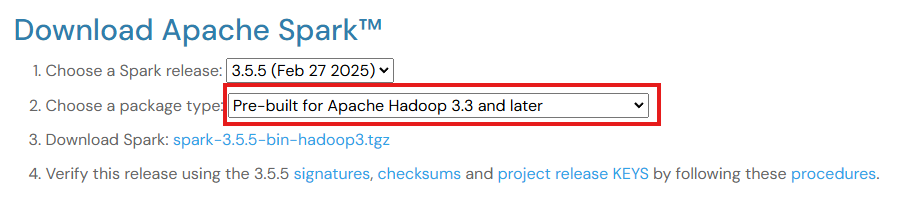
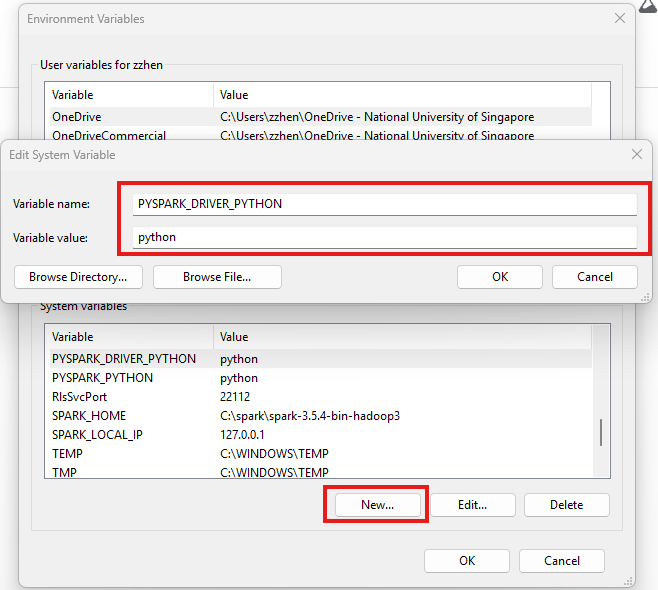
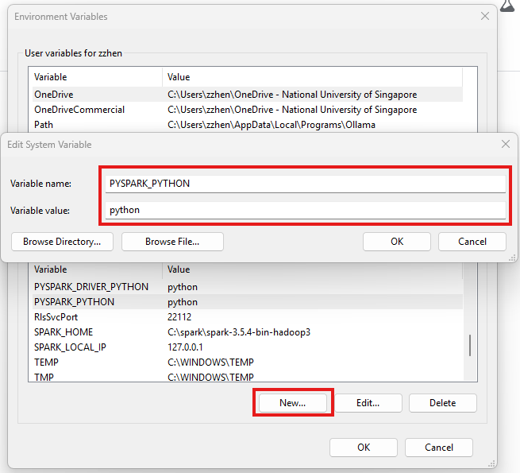
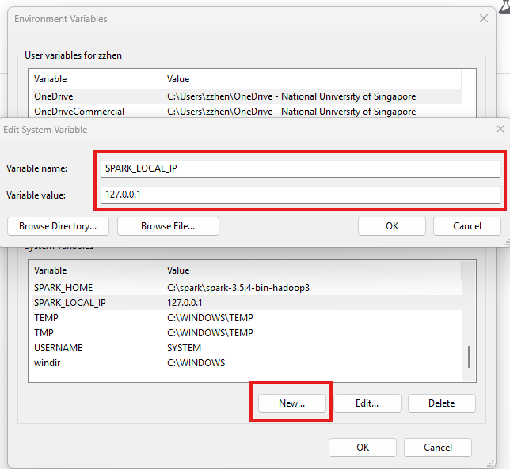

# 🤖 automating-esg-data-extraction-and-performance-analysis

## Repository Description

This repository contains the code, documentation, and resources for Group 6 of the NUS course DSA3101: Data Science in Practice for the AY24/25 Semester 2.

## Project Description

This project aims to design an automated ESG data extraction and performance evaluation system through the use of Natural Language Processing techniques.

## Project Overview

## 🚀 Getting Started

## 🌀 Run Data Pipeline and RAG

This section here is intened for a single Docker container setup for the data pipeline and RAG. 
In due course, it will be integrated into the the multi Docker container setup.

### Pre-Requisites

- [**Python 3.10.x**](https://www.python.org/downloads/)
  - Python >= 3.11.x may not work well with Spark NLP since the library is poorly maintained.
- [**Java 11**](https://www.oracle.com/sg/java/technologies/downloads/#java11)
  - Needed for Apache Spark, PySpark and Spark NLP
  - Although Apache Spark supports Java 8, 11, 17, Spark NLP only supports Java 8 and 11.
  - For Java 8, older versions of it might not be supported.
  - Thus, Java 11 is the choice for this project.
- [**Apache Spark**](https://spark.apache.org/downloads.html)
  - We have only tested up to version 3.5.4
  - For future versions, may need to manually check if it is compatible with both PySpark and SparkNLP
  - Needed for PySpark and Spark NLP
- [**Docker Desktop**](https://www.docker.com/products/docker-desktop/)
  - Needed to run containers
  - Certain services like Elasticsearch can only run with Docker if you want to use it locally.
- [**Ollama**](https://ollama.com/)
  - An API to run LLMs like llamma 3.2 which we are using for this project.

>[!NOTE]
>
>- The installation of Docker Desktop should be straightforward just by clicking the link and following the official Download instructions.
>- For installation of Java 11 and Apache Spark, can refer to this [Article](https://medium.com/@deepaksrawat1906/a-step-by-step-guide-to-installing-pyspark-on-windows-3589f0139a30) and follow through.
>- Note that in the article, they mentioned about downloading `winutils.exe` from a [GitHub repo](https://github.com/steveloughran/winutils).
> However, there are many versions.
> To pick the correct one, take note of "Choose a package type:" when downloading Apache Spark. For example, in the image below, it shows 3.3.
> Thus, we should download `winutils.exe` from the `hadoop-3.0.0/bin` [folder](https://github.com/steveloughran/winutils/tree/master/hadoop-3.0.0/bin).
> 

>[!IMPORTANT]
>
> - It is important to set the various system environment variables (`JAVA_HOME`, `SPARK_HOME`, `HADOOP_HOME`) and add their binary folders (`/bin/`) to system PATH, as stated in the article.
> - To prevent `Py4JJavaError` when using Spark, we need to set a few extra system environment variables.
> - Go to "Edit the system environment variables" on Windows and create new environment variables (`PYTHON_DRIVER_PYTHON`, `PYSPARK_PYTHON`, `SPARK_LOCAL_HOME`)
> and set their values as (`python`, `python`, `127.0.0.1`) respectively and save it. See images below for more details.
> 
> 
> 

## 🧊 Contributing

All contributions are to be merged to main via pull request.

### Branches

- branches recommended to follow the following format: `<username>-<feature>-<subfeature>`
  - `<name>`: GitHub username or any name that is easy to identify the owner of the branch. Strictly no spaces and all letters in lowercase.
  - `<feature>`: The name of the feature that the code is meant for.
  - `<subfeature>`: Optional input. Depends on whether the main feature is being broken down into subfeatures due to its complexity.
- For example: `nghockleong-loginpage-userauthentication`

### Commit Messages

Be clear and concise with the intent of the commit.

### Coding guidelines

Follows general software engineering practices. Some examples of good practices are as follows:

- Clear documentation for code written
- Meaningful function and variable names
- Refactor overly complex code into smaller chunks of code
- Code should avoid being interdependent (Changing 1 code chunk does not require huge changes across other code chunks and modules)
- Adhere to official style guides for all languages to the best of your ability.
  - Python style guide: [PEP 8 - Python Style Guide](http://www.python.org/dev/peps/pep-0008)
- Do not push your secrets such as API keys to GitHub; store them in a `.env` file instead.
- Do not push model checkpoint or weights files (`.pth` or `.pt`) to GitHub as you most likely won't succeed due to the large file size.
- Do not push datasets to GitHub as it may cuz the changes count to explode on GitHub.

## 🌐 Repository Structure

## 📋 Documentations
