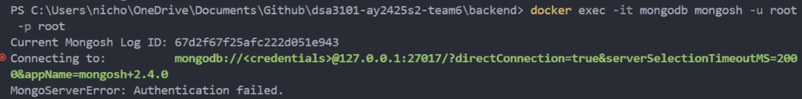
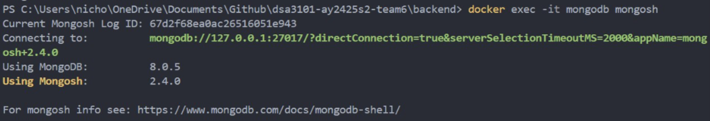
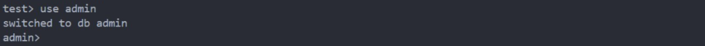
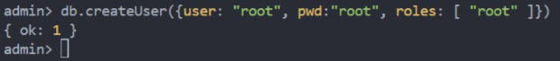

# Backend

This folder will contain all the relevant files required to set up the Web Application's Backend.
Details regarding the set-up of the Backend server can be found in the project's main README page.

## Brief Overview of Services:

- Express Server to receive and handle API calls from the frontend
- MongoDB - Contains the Company and User collections
- PostgreSQL DB - Contains the Weight Transactions, Click Transactions and Company Stock Price data tables

## Navigating the `src` folder:

- `api` folder: Contains all the functions and routes for our Express server to receive and handle API requests
  - `controllers` folder: Contains all the functions (and helper) which will be executed whenever the API routes are called
  - `misc` folder: Contains the Guest Profile configuration to be used in the respective controllers
  - `models` folder: Contains the MongoDB collections and PostgreSQL pool configuration
  - `routes` folder: Defines the various API routes
- Other files
  - `esgScoresHelper.js` file: Contains helper functions to calculate required values for our `mongoDB.js` file
  - `mongoDB.js` file: Connects to MongoDB and sets up the collections as required
  - `pgDB.js` file: Creates the necessary tables and data in our Postgre Database
  - `server.js` file: Does the entire set-up of our backend services

## Our core backend components are:
1) MongoDB container
2) PostgreSQL container
3) Web app backend

## Instructions to turn on backend

### Pre-requisites:
1) Docker desktop to run MongoDB and PostgreSQL containers
2) Node.js and npm installed
3) .env file with the following variables in this folder:
```
MONGODB_USERNAME=root
MONGODB_PASSWORD=root
POSTGRES_USER=postgres
POSTGRES_PASSWORD=root
EXPRESS_PORT=5000
JWT_KEY="testing"
```

1) Start MongoDB and PSQL docker container
Head over to `docker/` and run the following command:
```
docker compose up -d
```
Ensure that inside your `docker/` folder, you already have the following variables in the .env folder inside `docker/` folder:
```
MONGODB_USERNAME=root
MONGODB_PASSWORD=root
POSTGRES_USER=postgres
POSTGRES_PASSWORD=root
```
Important note for mongoDB:
 While we have created our running instances, we will need to set up the appropriate user for our MongoDB instance, as it is not created previously.
   This means that running the following command will lead to an error:

   ```shell
   docker exec -it mongodb mongosh -u root -p root
   ```

   This command follows the structure of docker exec -it [CONTAINER_NAME] mongosh -u [MONGODB_USERNAME] -p [MONGODB_PASSWORD]. An example of the error is as shown:
   
   This error means that we have not created the aforementioned user yet. Hence, we will need to create it as such:

   1. Go into the terminal without any authentication by running the following command:

   ```shell
   docker exec -it mongodb mongosh
   ```

   An example is shown below:
   

   2. Then, in the terminal, we will go into the admin database, and create the user using the following commands:

   ```shell
   use admin
   ```

   

   ```shell
   db.createUser({user: MONGODB_USERNAME, pwd: MONGODB_PASSWORD, roles:["root"]})
   ```

   Example:
   

   Once done, the user should be created properly. You may check this by exiting the `mongosh` terminal, and run the `docker exec -it mongodb mongosh -u root -p root` command in the `/backend` folder directory, which should be successful now.

2) install dependencies for web app backend using following command
```
npm install
```
3) run the server script from this directory using the following command:
```
node src/server.js
```

The backend server should start up


  
