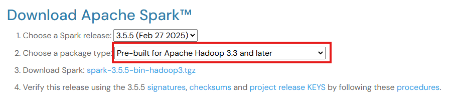
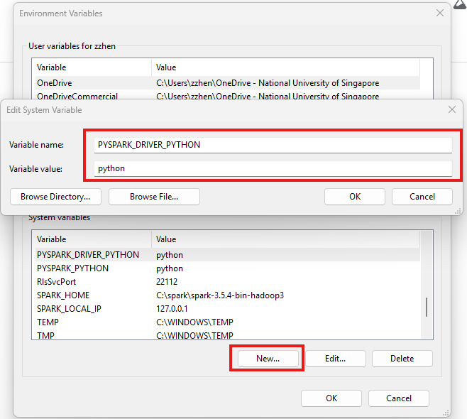
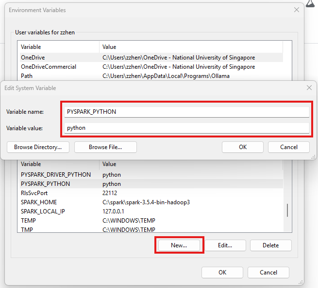
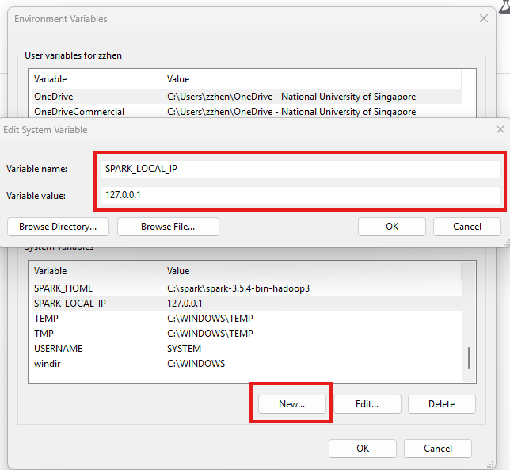

# Overview of `data-pipelines` folder

This folder contains scripts to run data pipelines.
To avoid error, create the following folders as shown below:
```
data-pipelines/
├── data/
│   ├── esg-data-against-external-eval/
│   ├── esg-json/
│   ├── esg-metric/
│   ├── esg-pdf/
│   ├── esg-spark-process-csv/
│   └── external-esg-data-csv/
```
`data/` folder contains **MOST** of the raw data + data outputs for the entire project.
Missing:
1) ESG model evaluation by test case results
2) Stocks prediction data (should be in the `docker/` folder as it needs to be copied and fed into PSQL container subsequently via
```
docker cp ./companies_stock_price_data.csv postgres:/var/lib/postgresql/data
```
3) sample ESG data to be fed into our dashboards in `frontend/esg_data.json`

We have 4 pipelines in total:
1) `pdf_to_elasticsearch.py`: Converts raw PDF files **named in our convention** stored in our google drive into text chunks and uploaded onto ElasticSearch. Code has the following outputs in the following directories:
- PDF file downloaded locally in `esg-pdf/` with the format: <report_year>_<company_name>_ESG_Report.pdf
- JSON file containing PDF data at a page level found in `esg-json/`
- CSV file containing smaller text chunks found in `esg-spark-process-csv` produced by sparkNLP

Pipeline for `pdf_to_elasticsearch.py`:
Google Drive (Simulating Amazon S3) -> PDF locally -> JSON -> CSV -> ElasticSearch

2) `generate_esg_metrics_json.py`
Based on PDF reports stored in ElasticSearch, generate stated metrics for given companies and outputs in `esg-metric/` as `rag_output.json`
Generation of this requires the model API endpoint to be active. Refer to README.md in `models/` to find out more.

3) `newsapi_to_elasticsearch.py`
Using NewsAPI, scrape ESG data for selected companies within a given time period and produces a .csv file for each company in the following format: scraped_data_<company_name>_<start_date>_to_<end_date>.csv which will be stored in `external-esg-data-csv/`. After creating these .csv files, uploads them onto ElasticSearch

4) `fact_check_esg_report_json_against_ext.py`
Given `rag_output.json` within `esg-metric/` folder, for each output, run a cross validation with external data that is already stored in ElasticSearch. After processing, produces output in `esg-data-against-external-eval/` folder.

## Prequisites
1) Ollama desktop with llama:3.2 pulled
```
ollama pull llama3.2
```
2) Docker desktop to run ElasticSearch container
3) Python library dependencies within `requirements.txt` found in this directory
```
pip install -r requirements.txt
```
4) [**Python 3.10.x**](https://www.python.org/downloads/)
  - Python >= 3.11.x may not work well with Spark NLP since the library is poorly maintained.
5) [**Java 11**](https://www.oracle.com/sg/java/technologies/downloads/#java11)
  - Needed for Apache Spark, PySpark and Spark NLP
  - Although Apache Spark supports Java 8, 11, 17, Spark NLP only supports Java 8 and 11.
  - For Java 8, older versions of it might not be supported.
  - Thus, Java 11 is the choice for this project.
6) [**Apache Spark**](https://spark.apache.org/downloads.html)
  - We have only tested up to version 3.5.4
  - For future versions, may need to manually check if it is compatible with both PySpark and SparkNLP
  - Needed for PySpark and Spark NLP
> [!NOTE]
>
> - The installation of Docker Desktop should be straightforward just by clicking the link and following the official Download instructions.
> - For installation of Java 11 and Apache Spark, can refer to this [Article](https://medium.com/@deepaksrawat1906/a-step-by-step-guide-to-installing-pyspark-on-windows-3589f0139a30) and follow through.
> - Note that in the article, they mentioned about downloading `winutils.exe` from a [GitHub repo](https://github.com/steveloughran/winutils).
>   However, there are many versions.
>   To pick the correct one, take note of "Choose a package type:" when downloading Apache Spark. For example, in the image below, it shows 3.3.
>   Thus, we should download `winutils.exe` from the `hadoop-3.0.0/bin` [folder](https://github.com/steveloughran/winutils/tree/master/hadoop-3.0.0/bin).
>   

> [!IMPORTANT]
>
> - It is important to set the various system environment variables (`JAVA_HOME`, `SPARK_HOME`, `HADOOP_HOME`) and add their binary folders (`/bin/`) to system PATH, as stated in the article.
> - To prevent `Py4JJavaError` when using Spark, we need to set a few extra system environment variables.
> - Go to "Edit the system environment variables" on Windows and create new environment variables (`PYTHON_DRIVER_PYTHON`, `PYSPARK_PYTHON`, `SPARK_LOCAL_HOME`)
>   and set their values as (`python`, `python`, `127.0.0.1`) respectively and save it. See images below for more details.
>    >  > 


## Specific information for each pipeline batch scripts: